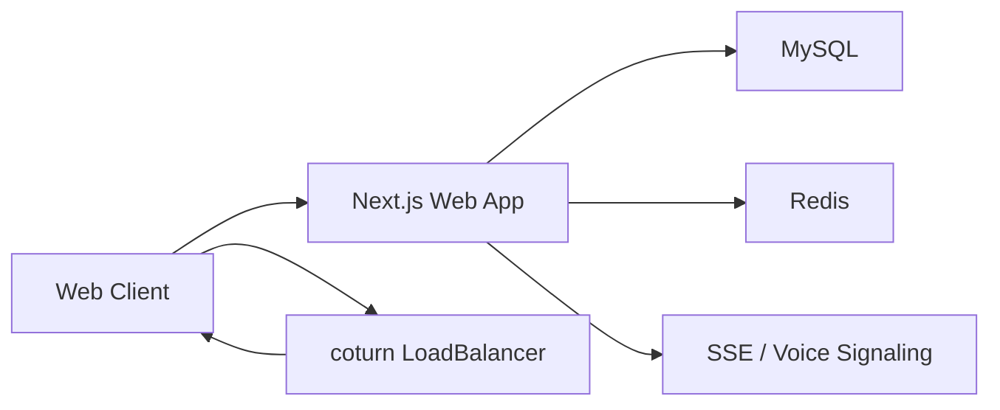

# 语音房 RTC 部署手册

## 目标

为 `/api/match/room/voice/*` 相关能力提供可上线的 TURN 中继、SSE 信令同步和临时凭据分发方案，保证真实匹配房在跨网络、NAT、弱网环境下仍可建立稳定语音链路。

## 当前代码接入点

- WebRTC ICE 配置分发: `/Users/lijuntu/Desktop/youda/youda-reborn/apps/web/src/app/api/match/room/voice/config/route.ts`
- 语音房 SSE 事件流: `/Users/lijuntu/Desktop/youda/youda-reborn/apps/web/src/app/api/match/room/voice/events/route.ts`
- 服务端语音信令接口: `/Users/lijuntu/Desktop/youda/youda-reborn/apps/web/src/app/api/match/room/voice/route.ts`
- 临时 TURN 凭据生成: `/Users/lijuntu/Desktop/youda/youda-reborn/apps/web/src/lib/turn-credentials.ts`
- RTC 配置组合逻辑: `/Users/lijuntu/Desktop/youda/youda-reborn/apps/web/src/lib/rtc-config.ts`
- 前端语音链路: `/Users/lijuntu/Desktop/youda/youda-reborn/apps/web/src/lib/use-voice-room-audio.ts`

## 推荐拓扑

## 环境变量

Web 服务至少需要以下 RTC 变量：

- `TURN_SHARED_SECRET`
- `TURN_UDP_URL`
- `TURN_TLS_URL`
- `TURN_CREDENTIAL_TTL_SECONDS`
- `RTC_ICE_SERVERS_JSON`

建议做法：

- `RTC_ICE_SERVERS_JSON` 仅放公共 STUN 或静态兜底配置
- 真正生产可用的 TURN 账号不要长期写死到前端
- 通过 `TURN_SHARED_SECRET` 开启 TURN REST API 风格的临时凭据

## Docker 本地联调

已经提供样例：

- `/Users/lijuntu/Desktop/youda/youda-reborn/deployments/docker/docker-compose.yml`
- `/Users/lijuntu/Desktop/youda/youda-reborn/deployments/docker/coturn/turnserver.conf`

启动后检查：

1. `3478/udp` 与 `3478/tcp` 可达
2. `5349/tcp` 可达
3. 浏览器访问匹配房时 `/api/match/room/voice/config` 能返回 TURN 地址

## Kubernetes 上线

已经提供样例：

- `/Users/lijuntu/Desktop/youda/youda-reborn/deployments/k8s/coturn.yaml`
- `/Users/lijuntu/Desktop/youda/youda-reborn/deployments/k8s/web-deployment.yaml`

上线前请确认：

1. `turn.youda.example.com` 已解析到 coturn 的公网 LB
2. TLS 证书已绑定 `turns:5349`
3. 安全组已放通 `3478/tcp`、`3478/udp`、`5349/tcp`、中继端口段 `49160-49200/udp`
4. `youda-web-secrets` 中已注入 `turn-shared-secret`

## TURN Secret 轮换

推荐流程：

1. 在密钥管理服务中生成新的 `TURN_SHARED_SECRET`
2. 先更新 coturn 实例并灰度发布
3. 再更新 Web 应用中的 `TURN_SHARED_SECRET`
4. 观察 2 个凭据 TTL 周期，确认旧凭据自然失效
5. 清理旧 secret

## 监控项

建议接入以下指标：

- `/api/match/room/voice/events` 建连数
- `/api/match/room/voice` 信令成功率
- TURN 分配成功率
- ICE 连接成功率
- 平均建连时长
- 房间首包语音时间

推荐阈值：

- ICE 建连成功率 < 92% 告警
- TURN 分配失败率 > 3% 告警
- SSE 断开率 > 5% 告警
- 语音房首包时间 P95 > 4s 告警

## 压测建议

- 先做 100 房、200 房、500 房三档并发
- 至少覆盖 “同城宽带 / 跨运营商 / 移动网络 / 海外网络”
- 分别验证 `stun only`、`turn udp`、`turn tls`
- 校验音频质量指标：丢包率、抖动、建连耗时、断线重连耗时

## 当前仍需外部落地的部分

- 真实 coturn 集群部署
- 真实公网域名与证书
- 多地域 TURN 节点调度
- 可视化 RTC 质量监控面板
- 基于 WebSocket 或专用 RTC 信令服务的进一步低延迟升级
