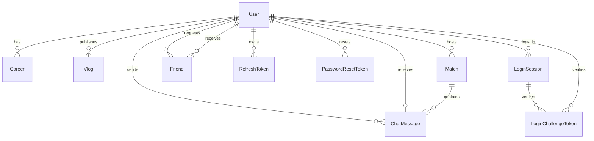

# 数据库 ER 与索引设计

## 1. 方案选型

- 数据库：MySQL 8.x
- ORM：Prisma
- 字符集：`utf8mb4`
- 排序规则：`utf8mb4_unicode_ci`
- 连接策略：`DATABASE_URL` 指向连接池入口，`DIRECT_DATABASE_URL` 供 Prisma 迁移与直连任务使用

## 2. ER 图

## 3. 核心关系说明

### 3.1 `users`

- 存储账号主数据、认证摘要、主页资料、徽章与最后登录时间
- `email` 和 `username` 均为全局唯一索引
- 用户删除时，关联的职业、生涯、会话、重置令牌、挑战令牌会级联删除

### 3.2 `friends`

- 使用双向记录建模好友关系与申请关系
- `messageRetentionPolicy` 决定删好友时私聊消息保留还是清理
- `(userId, friendId)` 唯一索引防止重复关系

### 3.3 `matches`

- 存储发起人、游戏类型、人格标签、房间码和状态
- 主查询为“按用户查房间历史”和“按状态查活跃房间”

### 3.4 `chat_messages`

- 同一张表承载匹配房消息与一对一私聊
- `matchId` 为空表示私聊，`receiverId` 为空表示房间广播消息
- 房间删除采用 `SET NULL`，保证消息审计可保留

### 3.5 `refresh_tokens`

- 存储 Refresh Token 摘要、过期时间、最近使用时间与吊销状态
- 通过 `loginSession.refreshTokenId` 把活跃刷新令牌绑定回登录会话

### 3.6 `login_sessions` / `login_challenge_tokens`

- `login_sessions` 记录登录 IP、UA、设备指纹、吊销态与最近活跃时间
- `login_challenge_tokens` 负责异地登录挑战验证，15 分钟有效
- 通过 `verificationState` 区分 `TRUSTED` 与 `PENDING_REVERIFY`

## 4. 索引设计

| 表 | 索引 | 用途 |
|---|---|---|
| `users` | `unique(email)` | 登录、找回密码、异地登录提醒 |
| `users` | `unique(username)` | 登录、注册唯一性校验 |
| `users` | `index(createdAt)` | 用户增长趋势与运营看板 |
| `friends` | `(userId, status, createdAt)` | 我的好友、待处理申请 |
| `friends` | `(friendId, status, createdAt)` | 被申请列表 |
| `matches` | `(hostUserId, createdAt)` | 用户发起的房间历史 |
| `matches` | `(status, createdAt)` | 活跃匹配池扫描 |
| `chat_messages` | `(matchId, createdAt)` | 房间消息时间线 |
| `chat_messages` | `(senderId, createdAt)` | 发送记录 |
| `chat_messages` | `(receiverId, createdAt)` | 私聊收件箱 |
| `chat_messages` | `(senderId, receiverId, createdAt)` | 双向私聊历史 |
| `vlogs` | `(userId, createdAt)` | 个人主页内容流 |
| `vlogs` | `(gameName, createdAt)` | 游戏内容聚合 |
| `careers` | `(userId, createdAt)` | 用户生涯展示 |
| `careers` | `(gameName, createdAt)` | 游戏维度统计 |
| `refresh_tokens` | `(userId, expiresAt)` | 会话清理和轮换 |
| `refresh_tokens` | `(userId, revokedAt)` | 吊销态快速校验 |
| `password_reset_tokens` | `(userId, expiresAt)` | 重置链接校验 |
| `login_sessions` | `(userId, createdAt)` | 登录审计 |
| `login_sessions` | `(userId, deviceFingerprint)` | 异地登录判断 |
| `login_challenge_tokens` | `(userId, expiresAt)` | 登录挑战清理 |
| `login_challenge_tokens` | `(loginSessionId, expiresAt)` | 单会话挑战校验 |

## 5. 级联删除策略

| 关系 | 删除策略 | 说明 |
|---|---|---|
| `User -> Career` | `CASCADE` | 用户删除时生涯记录同步清理 |
| `User -> Vlog` | `CASCADE` | 用户内容清理 |
| `User -> Match` | `CASCADE` | 用户房间主数据清理 |
| `User -> Friend` | `CASCADE` | 好友关系清理 |
| `User -> RefreshToken` | `CASCADE` | 会话凭据清理 |
| `User -> PasswordResetToken` | `CASCADE` | 重置凭据清理 |
| `User -> LoginSession` | `CASCADE` | 登录审计清理 |
| `Match -> ChatMessage` | `SET NULL` | 保留消息审计而不悬挂外键 |
| `User(receiver) -> ChatMessage` | `SET NULL` | 保留消息正文 |
| `LoginSession -> LoginChallengeToken` | `SET NULL` | 允许保留挑战记录 |

## 6. 高频查询建议

- 用户主页读取：优先走 `users + careers + vlogs` 的聚合查询，按 `createdAt DESC`
- 匹配房时间线：按 `matchId + createdAt` 范围拉取，避免全表扫描
- 私聊窗口：使用 `(senderId, receiverId, createdAt)` 双向组合条件
- 会话刷新：按 `tokenHash` 唯一索引命中后，再校验 `sessionId` 和 `revokedAt`

## 7. Serverless 生产建议

- Web 运行时使用连接池入口 `DATABASE_URL`
- 迁移、seed、回滚使用 `DIRECT_DATABASE_URL`
- Prisma Client 全局单例缓存，避免热实例重复建连
- 冷启动验证命令：`pnpm --filter @youda/database benchmark:serverless`
